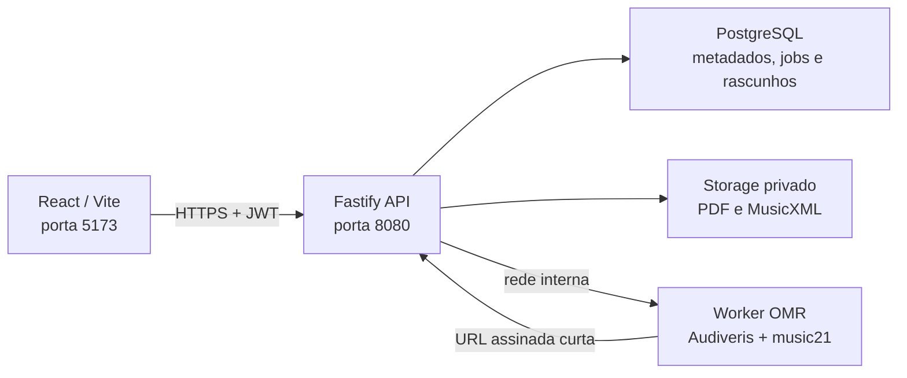

# Importação de partituras

## Visão geral



O navegador conhece somente a API. Ele nunca acessa PostgreSQL, credenciais
do storage ou o worker. O worker não recebe credenciais de banco e não deve
possuir uma porta pública.

## Execução local com Docker Compose

Requisitos: Docker Desktop com Compose v2 e suporte a imagens `linux/amd64`.

```bash
npm run stack:up
```

Serviços:

| Serviço | Endereço local | Responsabilidade |
| --- | --- | --- |
| `dev` | `http://127.0.0.1:5173/cavaquinho-lab/` | React/Vite |
| `api` | `http://127.0.0.1:8080/api/health` | autenticação, validação, jobs e revisão |
| `postgres` | `127.0.0.1:5432` | dados locais persistidos |
| `omr-worker` | somente rede Docker, porta `8090` | PDF → MusicXML |

O primeiro build do worker é grande porque inclui Audiveris e modelos OCR.
Espere todos os healthchecks ficarem saudáveis:

```bash
npm run stack:status
npm run stack:logs
```

No desenvolvimento, os três serviços observam o código local:

- Vite atualiza JSX e CSS.
- `tsx watch` reinicia a API ao alterar TypeScript.
- `watchfiles` reinicia somente o servidor Python quando `server.py`,
  `pipeline.py` ou `normalize.py` mudam.

Testes Python não reiniciam o worker. Uma alteração durante um reconhecimento
interrompe a requisição local; a API a trata como falha transitória e aplica o
retry normal. Use `npm run stack:rebuild` após alterar dependências ou imagens.

Para encerrar sem apagar o banco:

```bash
npm run stack:down
```

Use `docker compose down -v` somente quando quiser apagar deliberadamente o
banco e os uploads locais. Banco e fontes privadas usam volumes Docker e
permanecem disponíveis durante hot reload e reinicializações normais.

## Diagnóstico de `api_unavailable`

1. Abra `http://127.0.0.1:8080/api/health`; deve responder `{"status":"ok"}`.
2. Execute `npm run stack:status`; os três serviços backend devem estar
   `healthy`.
3. Confirme que a aplicação foi aberta por `127.0.0.1:5173` ou
   `localhost:5173`, ambas permitidas no Compose.
4. Depois de reiniciar a API, escolha o PDF novamente se quiser recuperar
   também sua prévia original.
5. Consulte `npm run stack:logs`; erros distinguem API, worker, timeout e OMR.

## Deploy de produção

O GitHub Pages hospeda apenas arquivos estáticos. A importação requer uma API
HTTPS publicamente acessível:

1. Publique PostgreSQL e storage privado, preferencialmente Supabase.
2. Execute as migrations de `apps/api/migrations` em ordem.
3. Publique `apps/api/Dockerfile` com `DATABASE_URL`, `SUPABASE_URL`,
   `SUPABASE_SERVICE_ROLE_KEY`, `OMR_WORKER_URL`, `PUBLIC_API_URL` e
   `CORS_ALLOWED_ORIGINS`.
4. Publique `workers/omr/Dockerfile` em rede privada e permita downloads
   somente do host da API.
5. Configure `CORS_ALLOWED_ORIGINS` com a origem exata do frontend.
6. Configure a variável GitHub Actions `VITE_API_URL` com a URL pública HTTPS
   da API e publique novamente o Pages.
7. Verifique `/api/health`, faça um upload pequeno e monitore um job completo.

`PUBLIC_API_URL` precisa ser alcançável pelo worker para baixar arquivos por
URLs assinadas. Em Compose ela é `http://api:8080`; em produção deve ser uma
URL interna ou pública controlada. Nunca coloque chaves de serviço em
variáveis `VITE_*`.

### Separação recomendada

- Frontend estático: GitHub Pages.
- API: serviço Node 22 com uma instância inicial e healthcheck.
- Banco/Auth/Storage: Supabase gerenciado.
- Worker: serviço `linux/amd64` privado, com CPU/memória maiores e
  concorrência limitada.

Audiveris é AGPL-3.0. Ao disponibilizar o worker por rede, publique o código
fonte correspondente e as instruções de build. A API e o frontend permanecem
separados sob MIT.

## Limite do primeiro lançamento

O fluxo confiável aceita MusicXML de uma única pauta melódica monofônica com cifras. PDF é uma entrada probabilística beta: o worker Audiveris é isolado e licenciado sob AGPL-3.0. Áudio e reconhecimento automático de acordes não fazem parte desta fase.

## Fronteiras

- `apps/api`: API Fastify em TypeScript, contratos Zod, autenticação JWT do Supabase e autorização por proprietário.
- PostgreSQL: importações, rascunhos, jobs, correções auditáveis e exercícios. A migration habilita RLS; a API continua responsável por toda autorização.
- Storage privado: upload assinado e remoção pela API. A chave de serviço nunca chega ao navegador.
- `workers/omr`: processo AGPL separado, sem credenciais de banco, que produz MusicXML para o normalizador.
- React: revisão por medida. Não acessa banco ou storage diretamente.

## Estados e idempotência

`uploaded → queued → processing → draft|needs_correction|failed`, seguido de `draft → ready`. O hash SHA-256 é único por proprietário. Jobs guardam disponibilidade, lock, tentativas e versão do pipeline. Consumidores devem reivindicar jobs com `FOR UPDATE SKIP LOCKED`, timeout e backoff; Redis não é necessário no primeiro ciclo.

## Confiança e revisão

MusicXML recebe confiança 1. O contrato já preserva probabilidades e alternativas para OMR. Erros temporais críticos bloqueiam a prática; avisos de baixa confiança não bloqueiam. Toda alteração usa `revision` otimista e deve gerar um evento de correção. Correções privadas não podem alimentar treinamento sem consentimento explícito e anonimização.

## Segurança operacional

- 20 MB, 20 páginas, 20 importações diárias e cinco jobs ativos por usuário.
- Validar MIME e assinatura, bloquear DTD/entidades XML e limitar profundidade antes do parser.
- Antivírus obrigatório antes de enfileirar PDF.
- CORS restrito e URLs assinadas curtas.
- Logs registram IDs/códigos, nunca conteúdo musical, tokens ou URLs assinadas.
- Exclusão remove fonte, renders, MusicXML, rascunho e derivados.

## Resiliência do reconhecimento

Antes do Audiveris, o worker faz um preflight defensivo:

- valida assinatura, criptografia, tamanho, páginas e conteúdo visível;
- estima o tamanho rasterizado em 300 DPI;
- normaliza páginas com geometria anormal para A4 ou Carta, preservando a
  proporção do conteúdo;
- remove somente páginas comprovadamente vazias;
- tenta uma renderização intermediária em tons de cinza quando o PDF original
  não pode ser processado diretamente;
- limita quantidade, tamanho expandido, criptografia e caminhos dos arquivos
  internos de um MXL;
- rejeita MusicXML vazio ou sem conteúdo musical.

As normalizações ficam registradas na proveniência do rascunho, sem guardar
conteúdo musical nos logs. Falhas determinísticas, como PDF protegido ou
MusicXML inválido, não são repetidas automaticamente. Falhas transitórias de
rede ou processo usam até três tentativas com backoff. O processamento pode
usar até dez minutos e um job só é considerado abandonado após doze minutos.

Os testes privados de corpus exercitam o pipeline real sem versionar as
partituras:

```sh
CHORO_NEGRO_PDF=/caminho/privado/choro-negro.pdf npm run test:corpus:choro
NIVALDO_NO_CHORO_PDF=/caminho/privado/nivaldo.pdf npm run test:corpus:nivaldo
```

## Próximos incrementos

1. Executar a migration em um projeto Supabase de homologação e testar políticas de ownership.
2. Implementar claim transacional do worker, antivírus e limite real de páginas.
3. Completar edição estruturada de pitch, duração, cifra, ligadura, compasso e tonalidade.
4. Persistir os artefatos criados e conectá-los às práticas locais.
5. Criar corpus dourado e métricas separadas de raiz, qualidade, ritmo e classes raras.
